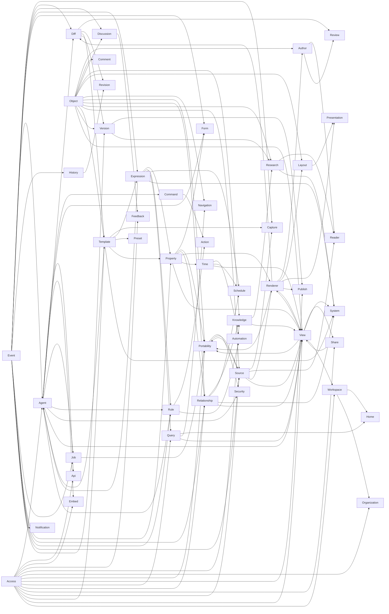

# FB Factory Content capability encyclopedia

<!-- Generated from the atomic records in chapters/, features/, and capabilities/. Do not edit this projection directly. -->

This index summarizes the atomic product contracts beneath the public roadmap. Each linked record owns its promise, dependencies, state, proof boundary, and relationship to complete Features.

## Catalog summary

- Chapters: 6
- Features: 32
- Named increments: 1
- Capabilities: 125

| Capability state | Count |
| ---------------- | ----: |
| Verified         |     4 |
| Failing          |     1 |
| Stale            |     0 |
| In Progress      |    18 |
| Approved Shape   |    89 |
| Exploring        |     8 |
| Deferred         |     0 |
| Superseded       |     5 |

## Dependency overview

## Access

| Capability                                                                 | State          | User promise                                                                                                       |
| -------------------------------------------------------------------------- | -------------- | ------------------------------------------------------------------------------------------------------------------ |
| [Page and Collection access](capabilities/content.access.page-database.md) | Approved Shape | Page and Collection roles separate reading, commenting, entry editing, and structure authority.                    |
| [Row-level privacy](capabilities/content.access.row-private.md)            | Approved Shape | A Page or Collection row can be shared more narrowly than its collection's ordinary visibility.                    |
| [Access-safe computation](capabilities/content.access.safe-aggregate.md)   | Exploring      | Counts, rollups, groups, and aggregates reveal only records the viewer may access.                                 |
| [Visibility closure](capabilities/content.access.visibility-closure.md)    | Approved Shape | Ambient traversal and derived results omit inaccessible objects while known direct links receive an honest denial. |

## Action

| Capability                                              | State          | User promise                                                                                        |
| ------------------------------------------------------- | -------------- | --------------------------------------------------------------------------------------------------- |
| [Action Buttons](capabilities/content.action.button.md) | Approved Shape | An owner-governed Button invokes an ordinary action or Rule with typed inputs and visible authority |

## Agent

| Capability                                                                       | State          | User promise                                                                                                                                                                      |
| -------------------------------------------------------------------------------- | -------------- | --------------------------------------------------------------------------------------------------------------------------------------------------------------------------------- |
| [Agent and UI parity](capabilities/content.agent.action-parity.md)               | In Progress    | Humans and agents use the same operations and visible state                                                                                                                       |
| [Audience-safe synthesis](capabilities/content.agent.audience-safe.md)           | Approved Shape | A governed agent run can synthesize from only the resources every intended viewer may access and consent to use for that audience.                                                |
| [Agent-run automation](capabilities/content.agent.automation.md)                 | Approved Shape | AI work composes Event → expression/query → action → mutation → Event                                                                                                             |
| [Agent-authored Expressions](capabilities/content.agent.expression-authoring.md) | Approved Shape | Ask an agent to draft or repair a typed expression without giving it a private execution or save path.                                                                            |
| [Agent presence](capabilities/content.agent.presence.md)                         | In Progress    | One accountable agent presence gives authorized collaborators an ephemeral view of a run's current locations without replacing durable attribution, review, or the real mutation. |
| [Agent resource consent](capabilities/content.agent.resource-consent.md)         | Approved Shape | Resources independently declare whether agents may use them as context and whether agents may edit them, while inheritable ceilings can narrow either decision.                   |
| [Skills catalog](capabilities/content.agent.skill-catalog.md)                    | Approved Shape | Governed reusable agent instructions and capabilities can be invoked against compatible Content targets                                                                           |

## API

| Capability                                             | State          | User promise                                                                             |
| ------------------------------------------------------ | -------------- | ---------------------------------------------------------------------------------------- |
| [Content API and CMS](capabilities/content.api.cms.md) | Approved Shape | External clients and websites can use Content without a second, weaker product contract. |

## Author

| Capability                                                        | State          | User promise                                                                                                                  |
| ----------------------------------------------------------------- | -------------- | ----------------------------------------------------------------------------------------------------------------------------- |
| [Executable Code blocks](capabilities/content.author.code.md)     | Approved Shape | Let me author, inspect, and deliberately run code in an ordinary document without hidden notebook state.                      |
| [Document editor](capabilities/content.author.document-editor.md) | In Progress    | Write and revise a rich document with blocks, comments, collaboration, media, and agent help in one humane surface.           |
| [Footnotes](capabilities/content.author.footnotes.md)             | Approved Shape | Add a durable explanatory or citation note without manually managing superscript text.                                        |
| [Math and equations](capabilities/content.author.math.md)         | In Progress    | Write an equation inline or as a block and have it stay intelligible everywhere I read or export it.                          |
| [Media Blocks](capabilities/content.author.media.md)              | In Progress    | Put images, audio, video, files, embeds, captions, and source-aware assets in a document without losing access or provenance. |
| [Mermaid diagrams](capabilities/content.author.mermaid.md)        | Approved Shape | Insert a diagram as ordinary Mermaid source and read a faithful rendered diagram when possible.                               |

## Automation

| Capability                                                           | State       | User promise                                                  |
| -------------------------------------------------------------------- | ----------- | ------------------------------------------------------------- |
| [Scheduled automation](capabilities/content.automation.scheduled.md) | In Progress | Scheduled queries and recurring heartbeats over current state |

## Capture

| Capability                                                       | State          | User promise                                                                             |
| ---------------------------------------------------------------- | -------------- | ---------------------------------------------------------------------------------------- |
| [Capture and enrichment](capabilities/content.capture.enrich.md) | Approved Shape | Send material to a chosen Collection and let its own rules turn it into durable context. |

## Command

| Capability                                                 | State          | User promise                                                                                      |
| ---------------------------------------------------------- | -------------- | ------------------------------------------------------------------------------------------------- |
| [Unified commands](capabilities/content.command.fabric.md) | Approved Shape | Slash, Cmd+K, menus, shortcuts, Buttons, and agents discover the same scoped commands and Actions |

## Comment

| Capability                                             | State          | User promise                                                                       |
| ------------------------------------------------------ | -------------- | ---------------------------------------------------------------------------------- |
| [Comments](capabilities/content.comment.page-owned.md) | Approved Shape | Threaded Comments stay owned by a Page while targeting one or more precise Blocks. |

## Diff

| Capability                                                             | State          | User promise                                                                                                                 |
| ---------------------------------------------------------------------- | -------------- | ---------------------------------------------------------------------------------------------------------------------------- |
| [Agent-assisted review](capabilities/content.diff.ai-assist.md)        | Approved Shape | Agents can summarize and guide large review sets without bypassing the authority to decide them.                             |
| [Filtered change review](capabilities/content.diff.filtered-review.md) | Approved Shape | A reviewer can accept or reject one change or an exact visible set without accidentally deciding newer or hidden changes.    |
| [In-place typed review](capabilities/content.diff.in-place.md)         | Approved Shape | Changes are reviewed inside the ordinary Page, Collection, Board, template, source, or code surface that gives them meaning. |

## Discussion

| Capability                                                 | State          | User promise                                                                                       |
| ---------------------------------------------------------- | -------------- | -------------------------------------------------------------------------------------------------- |
| [Page Discussion](capabilities/content.discussion.page.md) | Approved Shape | Every Page has one continuing Discussion for humane, Page-wide collaboration and curated activity. |

## Embed

| Capability                                                        | State          | User promise                                                                                                                      |
| ----------------------------------------------------------------- | -------------- | --------------------------------------------------------------------------------------------------------------------------------- |
| [Embedded host grants](capabilities/content.embed.host-grant.md)  | Approved Shape | An embedded host gets only the mount and Actions it was granted, never more authority than the viewer.                            |
| [MCP App embedding](capabilities/content.embed.mcp-app.md)        | Approved Shape | Compatible agent hosts can show a focused Content surface without receiving a copied object or broader authority.                 |
| [Embedded Content surface](capabilities/content.embed.surface.md) | Approved Shape | The same Page, View, or focused Content experience can appear in another app without splitting identity, history, or permissions. |

## Event

| Capability                                                  | State       | User promise                                                            |
| ----------------------------------------------------------- | ----------- | ----------------------------------------------------------------------- |
| [Committed Events](capabilities/content.event.committed.md) | In Progress | Meaningful committed changes have one durable, actor-aware Event spine. |

## Expression

| Capability                                                                    | State          | User promise                                                                                                  |
| ----------------------------------------------------------------------------- | -------------- | ------------------------------------------------------------------------------------------------------------- |
| [Cached expression results](capabilities/content.expression.cached-result.md) | Approved Shape | See the last valid computed value quickly while knowing whether it still reflects current inputs.             |
| [Expression catalog](capabilities/content.expression.catalog.md)              | Approved Shape | Promote a useful expression or variable into a governed reusable definition with clear ownership and version. |
| [Typed expression language](capabilities/content.expression.language.md)      | Approved Shape | Use one understandable expression language whenever a configuration needs computation.                        |

## Feedback

| Capability                                                     | State          | User promise                                                                                                       |
| -------------------------------------------------------------- | -------------- | ------------------------------------------------------------------------------------------------------------------ |
| [Reactions and Polls](capabilities/content.feedback.signal.md) | Approved Shape | Structured reactions and option-based Polls live inside the Page Discussion and can render through views or embeds |

## Form

| Capability                                                       | State          | User promise                                                                                                        |
| ---------------------------------------------------------------- | -------------- | ------------------------------------------------------------------------------------------------------------------- |
| [Shared Form engine](capabilities/content.form.shared-engine.md) | Approved Shape | Content Form Views and Agent-Native Forms use one schema, validation, permission, and idempotent submission engine. |

## History

| Capability                                           | State          | User promise                                                                                     |
| ---------------------------------------------------- | -------------- | ------------------------------------------------------------------------------------------------ |
| [History](capabilities/content.history.queryable.md) | Approved Shape | History is a full-height, access-scoped surface for inspecting and recovering meaningful change. |

## Home

| Capability                                         | State          | User promise                                                                                                                                      |
| -------------------------------------------------- | -------------- | ------------------------------------------------------------------------------------------------------------------------------------------------- |
| [Global Home](capabilities/content.home.global.md) | Approved Shape | Home belongs to the person and composes authorized work across Personal and organization contexts without pretending it all shares one Workspace. |

## Job

| Capability                                                  | State          | User promise                                                                                                             |
| ----------------------------------------------------------- | -------------- | ------------------------------------------------------------------------------------------------------------------------ |
| [Durable Content jobs](capabilities/content.job.durable.md) | Approved Shape | Long-running import, export, sync, and enrichment work survives interruption and tells the truth about partial progress. |

## Knowledge

| Capability                                                     | State          | User promise                                                                                                                |
| -------------------------------------------------------------- | -------------- | --------------------------------------------------------------------------------------------------------------------------- |
| [Graph queries](capabilities/content.knowledge.graph.md)       | Exploring      | Graph navigation and query over typed links, mentions, relations, and authority edges                                       |
| [Links and backlinks](capabilities/content.knowledge.links.md) | Approved Shape | Stable links, outline, backlinks, forward links, external-link health, and link-aware navigation through the Page Info rail |
| [Search](capabilities/content.knowledge.search.md)             | In Progress    | Fast access-aware search across titles, bodies, rows, sources, and later comments/review                                    |

## Layout

| Capability                                                          | State          | User promise                                                                                                 |
| ------------------------------------------------------------------- | -------------- | ------------------------------------------------------------------------------------------------------------ |
| [Responsive Page layout](capabilities/content.layout.responsive.md) | Approved Shape | Pages arrange, resize, and reorder Blocks in columns that remain coherent on smaller screens and in exports. |

## Navigation

| Capability                                                     | State          | User promise                                                                                                                 |
| -------------------------------------------------------------- | -------------- | ---------------------------------------------------------------------------------------------------------------------------- |
| [Personal sidebar](capabilities/content.navigation.sidebar.md) | Approved Shape | The sidebar is a personal navigation surface with pinned references and query-backed dynamic sections, not object hierarchy. |

## Notification

| Capability                                                   | State          | User promise                                                          |
| ------------------------------------------------------------ | -------------- | --------------------------------------------------------------------- |
| [Notifications](capabilities/content.notification.source.md) | Approved Shape | Canonical notifications exposed as queryable Content source and Views |

## Object

| Capability                                                                         | State          | User promise                                                                                                              |
| ---------------------------------------------------------------------------------- | -------------- | ------------------------------------------------------------------------------------------------------------------------- |
| [Blocks](capabilities/content.object.block.md)                                     | In Progress    | A Block is a stable addressable unit of rich content inside its owning field.                                             |
| [Blocks fields](capabilities/content.object.blocks-field.md)                       | In Progress    | Every editable rich-content body uses one Blocks-field grammar and keeps its own stable revision boundary.                |
| [Collections](capabilities/content.object.database.md)                             | Verified       | Collection: a Page-backed typed collection                                                                                |
| [Multiple Collection memberships](capabilities/content.object.multi-membership.md) | In Progress    | One Page can belong to several Collections without copies or a hidden primary home.                                       |
| [Pages](capabilities/content.object.page.md)                                       | Verified       | A durable Page keeps its identity, body, properties, access, discussion, and portable representation wherever it appears. |
| [References](capabilities/content.object.reference.md)                             | Approved Shape | A compact reference points to a stable Page, Collection, or Block without pretending to be computation.                   |
| [Synced Blocks and live embeds](capabilities/content.object.transclusion.md)       | Approved Shape | A Page or Block can appear by reference in several places and authorized edits change the one canonical object.           |

## Organization

| Capability                                                       | State          | User promise                                                                                                                   |
| ---------------------------------------------------------------- | -------------- | ------------------------------------------------------------------------------------------------------------------------------ |
| [Organization teams](capabilities/content.organization.teams.md) | Approved Shape | Canonical framework-wide Team membership can be managed through Content without giving each app a conflicting identity system. |

## Portability

| Capability                                                                                  | State          | User promise                                                                                                                                      |
| ------------------------------------------------------------------------------------------- | -------------- | ------------------------------------------------------------------------------------------------------------------------------------------------- |
| [Bounded collection export](capabilities/content.portability.collection-export.md)          | Verified       | Export the authorized records in one Collection or View to a readable file without changing what the View means or implying a whole-vault backup. |
| [PDF export](capabilities/content.portability.pdf-export.md)                                | In Progress    | Create a readable PDF of an authorized Content representation without confusing it with the editable or lossless export.                          |
| [Faithful round-tripping](capabilities/content.portability.roundtrip.md)                    | Approved Shape | Content preserves provider-owned meaning it cannot safely render or edit, so a supported change never silently destroys the rest of the work.     |
| [Portable Source representation](capabilities/content.portability.source-representation.md) | Approved Shape | Connected and local material has a portable Content representation without pretending Content owns every original.                                |
| [Portable vault export](capabilities/content.portability.vault-export.md)                   | Approved Shape | Take the authorized Content vault away in open files plus a lossless archive instead of remaining dependent on one service.                       |

## Presentation

| Capability                                                     | State          | User promise                                                                                                |
| -------------------------------------------------------------- | -------------- | ----------------------------------------------------------------------------------------------------------- |
| [Presentation mode](capabilities/content.presentation.mode.md) | Approved Shape | Pages and ordered records can present through shared Slides primitives without creating slide-only content. |

## Preset

| Capability                                        | State      | User promise                                                                                                              |
| ------------------------------------------------- | ---------- | ------------------------------------------------------------------------------------------------------------------------- |
| [Presets](capabilities/content.preset.catalog.md) | Superseded | Understand that older preassembled configurations now live as inspectable Templates rather than a competing product type. |

## Property

| Capability                                                                       | State          | User promise                                                                                                                       |
| -------------------------------------------------------------------------------- | -------------- | ---------------------------------------------------------------------------------------------------------------------------------- |
| [Actor properties](capabilities/content.property.actor.md)                       | Approved Shape | Know who actually created or last changed a record, whether that actor was a person, agent, automation, or integration.            |
| [Custom Properties](capabilities/content.property.catalog.md)                    | Exploring      | Reuse an approved field definition deliberately without making same-named local columns secretly equal.                            |
| [Property validation and defaults](capabilities/content.property.constraints.md) | Approved Shape | Configure requiredness, defaults, validation, formatting, and edit policy once and trust every write path to enforce them.         |
| [Guarded property changes](capabilities/content.property.guarded-change.md)      | Approved Shape | Require an explained confirmation or policy check before a sensitive field transition while keeping one general validation engine. |
| [Typed locations](capabilities/content.property.location.md)                     | Approved Shape | Store a place or coordinates as a meaningful location that maps, queries, sources, and export can understand.                      |
| [Typed Properties](capabilities/content.property.typed.md)                       | In Progress    | Define stored and computed fields whose values and descriptions stay meaningful in every surface.                                  |

## Publish

| Capability                                                   | State          | User promise                                                                                         |
| ------------------------------------------------------------ | -------------- | ---------------------------------------------------------------------------------------------------- |
| [Public publication](capabilities/content.publish.public.md) | Approved Shape | Publish one chosen Page revision at a stable public destination while private work continues safely. |
| [Public reading](capabilities/content.publish.reading.md)    | In Progress    | A shareable reading surface faithfully renders the intended public Content truth.                    |

## Query

| Capability                                                     | State          | User promise                                                                                                                                         |
| -------------------------------------------------------------- | -------------- | ---------------------------------------------------------------------------------------------------------------------------------------------------- |
| [Reusable Query objects](capabilities/content.query.object.md) | Approved Shape | A one-off inline Query can be promoted into a named reusable Content object that behaves like a dynamic Collection without owning its source records |

## Reader

| Capability                                                  | State          | User promise                                                                                                          |
| ----------------------------------------------------------- | -------------- | --------------------------------------------------------------------------------------------------------------------- |
| [Document Reader](capabilities/content.reader.documents.md) | Superseded     | The earlier separate PDF/EPUB reader proposal remains readable lineage rather than an active second product contract. |
| [Reader surface](capabilities/content.reader.surface.md)    | Approved Shape | Read and annotate text, documents, web material, and media through one specialized Content surface.                   |

## Relationship

| Capability                                                       | State          | User promise                                                                                                                         |
| ---------------------------------------------------------------- | -------------- | ------------------------------------------------------------------------------------------------------------------------------------ |
| [Typed Relationships](capabilities/content.relationship.edge.md) | Approved Shape | One typed edge substrate powers relation Properties, inline typed Page references, backlinks, Info, graph queries, and Graph editing |

## Renderer

| Capability                                                                        | State          | User promise                                                                                                                                              |
| --------------------------------------------------------------------------------- | -------------- | --------------------------------------------------------------------------------------------------------------------------------------------------------- |
| [Artifact Blocks](capabilities/content.renderer.artifact-block.md)                | Approved Shape | Make a one-off interactive or visual artifact on one page, then promote it only if reuse becomes real.                                                    |
| [Custom Blocks](capabilities/content.renderer.custom-block.md)                    | Approved Shape | Name, govern, and reuse a safe renderer without making it a hidden application.                                                                           |
| [Collection graph renderers (superseded)](capabilities/content.renderer.graph.md) | Superseded     | Historical umbrella for graph and chart rendering, now split into distinct semantic Graph and analytical Chart capabilities                               |
| [Typed renderers](capabilities/content.renderer.typed.md)                         | Approved Shape | Compatible renderers present typed Content values consistently across surfaces while preserving meaning, accessibility, inheritance, and export fallback. |

## Research

| Capability                                                 | State          | User promise                                                                                                  |
| ---------------------------------------------------------- | -------------- | ------------------------------------------------------------------------------------------------------------- |
| [Annotations](capabilities/content.research.annotation.md) | Approved Shape | Highlights, excerpts, and research notes remain anchored to the exact material and revision they interpret.   |
| [Citations](capabilities/content.research.citation.md)     | Approved Shape | A citation retains a durable source-and-locator identity even when its style or surrounding document changes. |

## Review

| Capability                                         | State     | User promise                                                                                    |
| -------------------------------------------------- | --------- | ----------------------------------------------------------------------------------------------- |
| [Code review](capabilities/content.review.code.md) | Exploring | Review typed code and file changes in the same in-place, filterable, durable-decision interface |

## Revision

| Capability                                                  | State          | User promise                                                                                                                 |
| ----------------------------------------------------------- | -------------- | ---------------------------------------------------------------------------------------------------------------------------- |
| [Suggestions](capabilities/content.revision.suggestions.md) | Approved Shape | Suggested changes remain authored pending Revisions until an authorized person accepts, rejects, defers, or supersedes them. |

## Rule

| Capability                                          | State       | User promise                           |
| --------------------------------------------------- | ----------- | -------------------------------------- |
| [Rules](capabilities/content.rule.deterministic.md) | In Progress | Event plus typed condition plus action |

## Schedule

| Capability                                                           | State     | User promise                                                                                                               |
| -------------------------------------------------------------------- | --------- | -------------------------------------------------------------------------------------------------------------------------- |
| [Schedule constraints](capabilities/content.schedule.constraints.md) | Exploring | Planning surfaces detect dependency and date violations, explain them, and apply only explicit policy or accepted repairs. |

## Security

| Capability                                                                 | State       | User promise                                                                                                                               |
| -------------------------------------------------------------------------- | ----------- | ------------------------------------------------------------------------------------------------------------------------------------------ |
| [Private vault encryption](capabilities/content.security.private-vault.md) | In Progress | Private-vault custody can be user-held and fail closed without disguising unresolved recovery, collaboration, or agent authority problems. |

## Share

| Capability                                          | State          | User promise                                                                                                                                  |
| --------------------------------------------------- | -------------- | --------------------------------------------------------------------------------------------------------------------------------------------- |
| [Shared Views](capabilities/content.share.views.md) | Approved Shape | A shared View gives collaborators a dependable starting presentation while preserving each viewer's existing access and personal exploration. |

## Source

| Capability                                                                        | State          | User promise                                                                                                                                                   |
| --------------------------------------------------------------------------------- | -------------- | -------------------------------------------------------------------------------------------------------------------------------------------------------------- |
| [Source adapters](capabilities/content.source.adapters.md)                        | In Progress    | Local, native, and provider Sources use one typed contract while each adapter proves only the operations it can safely perform.                                |
| [Builder round-trip codec](capabilities/content.source.builder-codec.md)          | Approved Shape | Builder JSON blocks can pass through one typed codec without supported edits erasing unfamiliar provider content.                                              |
| [Sources catalog](capabilities/content.source.catalog.md)                         | Approved Shape | One governed top-level Content Collection makes approved local, provider, and native Sources discoverable without hiding their scope, authority, or freshness. |
| [Files and folders as Sources](capabilities/content.source.file-folder.md)        | Exploring      | Open a selected file tree as a Source without forcing heterogeneous files into one Collection schema.                                                          |
| [Local Source bridge](capabilities/content.source.local-bridge.md)                | Approved Shape | A trusted device can synchronize explicitly selected local Sources while browsers remain useful without inheriting filesystem authority.                       |
| [Local project mode](capabilities/content.source.local-project.md)                | Superseded     | The former local-project proposal remains lineage for file-truth work, not an active dual-truth product contract.                                              |
| [Page-linked Sources](capabilities/content.source.page-link.md)                   | Exploring      | A Page can bind to one external item while keeping Content identity and the provider's ownership clear.                                                        |
| [Materialized multi-source Collections](capabilities/content.source.row-union.md) | Superseded     | The former multi-source row-union model remains migration evidence, while active composition moves toward source Queries.                                      |
| [Content spaces and Files](capabilities/content.source.spaces-files.md)           | Verified       | Personal and organization-backed Content spaces and Files views keep work navigable without becoming a second permission system.                               |
| [Source sync policy](capabilities/content.source.sync-policy.md)                  | Approved Shape | Each connected Source declares one plain-language policy for refresh and write-back: View only, Keep in sync, or Review before write-back.                     |

## System

| Capability                                                                       | State          | User promise                                                                                                                                               |
| -------------------------------------------------------------------------------- | -------------- | ---------------------------------------------------------------------------------------------------------------------------------------------------------- |
| [Task dependencies](capabilities/content.system.dependencies.md)                 | Approved Shape | Parent/subtask and blocked/blocking relations with constraints                                                                                             |
| [My Tasks](capabilities/content.system.my-tasks.md)                              | Approved Shape | “My Tasks” as an access-scoped dynamic saved view                                                                                                          |
| [Project status](capabilities/content.system.project-status.md)                  | Approved Shape | Project status updates and rollups as ordinary Content views/pages                                                                                         |
| [Research workspace Template](capabilities/content.system.research-workspace.md) | Exploring      | A blessed editable research template composes Sources, Notes, Projects, reading queues, citations, capture, and synthesis views over one Content datastore |
| [Blessed Task and Project Template](capabilities/content.system.task-project.md) | Approved Shape | Blessed editable Task/Project template over Content                                                                                                        |

## Template

| Capability                                                              | State          | User promise                                                                                                                  |
| ----------------------------------------------------------------------- | -------------- | ----------------------------------------------------------------------------------------------------------------------------- |
| [Template governance](capabilities/content.template.governance.md)      | Approved Shape | Find and adopt a reusable working system with clear ownership, approval, version, provenance, and access.                     |
| [Multi-object Templates](capabilities/content.template.graph.md)        | Approved Shape | Start from a reusable system of Pages, Collections, Views, Properties, Rules, expressions, and bodies, then own the result.   |
| [Collection item Templates](capabilities/content.template.item-body.md) | Approved Shape | Offer more than one useful starting body for a collection record, including a clear default and context-aware embedded views. |
| [Template updates](capabilities/content.template.update.md)             | Approved Shape | Review what changed in a template and selectively bring compatible improvements into my owned instance.                       |

## Time

| Capability                                                        | State          | User promise                                                      |
| ----------------------------------------------------------------- | -------------- | ----------------------------------------------------------------- |
| [Dates, times, and durations](capabilities/content.time.types.md) | Approved Shape | Date, Instant, ranges, Duration, and explicit timezone conversion |

## Version

| Capability                                                                     | State          | User promise                                                                                                  |
| ------------------------------------------------------------------------------ | -------------- | ------------------------------------------------------------------------------------------------------------- |
| [Named Page Versions](capabilities/content.version.branching.md)               | Approved Shape | Multiple named body versions evolve in parallel under one Page identity and shared properties                 |
| [Blocks-field revision history](capabilities/content.version.field-history.md) | Approved Shape | Every Blocks field preserves attributable comparison and recovery independently of later named Page Versions. |

## View

| Capability                                                                     | State          | User promise                                                                                                                                                                |
| ------------------------------------------------------------------------------ | -------------- | --------------------------------------------------------------------------------------------------------------------------------------------------------------------------- |
| [Canvas](capabilities/content.view.canvas.md)                                  | Approved Shape | Canvas lets people intentionally arrange reusable Content objects in a spatial View without copying them or accidentally asserting semantic relationships.                  |
| [Chart View](capabilities/content.view.chart.md)                               | Approved Shape | Chart turns authorized typed query results into understandable analytical visualizations that remain usable as saved Views, embedded Blocks, dashboards, and static output. |
| [View-derived creation defaults](capabilities/content.view.dynamic-create.md)  | Approved Shape | Creating through a View starts new records with safe contextual values without turning that View's filters into hidden validation.                                          |
| [Fast keyboard capture](capabilities/content.view.fast-capture.md)             | Approved Shape | Keyboard-fluent List and Table capture                                                                                                                                      |
| [Graph View](capabilities/content.view.graph.md)                               | Approved Shape | Graph lays out query-selected canonical objects and typed Relationships for access-safe exploration and editing.                                                            |
| [Grouping and aggregation](capabilities/content.view.grouping-aggregation.md)  | Approved Shape | Views group across several dimensions and compute access-safe totals, subtotals, rollups, and measures.                                                                     |
| [Map View](capabilities/content.view.map.md)                                   | Approved Shape | Map renders typed locations with points, clustering, filtering, and record previews before adding richer geographic layers.                                                 |
| [Personal View state](capabilities/content.view.personal-state.md)             | Approved Shape | A shared View remembers one private arrangement per person and supports named Only-me Views without copying records.                                                        |
| [Pivot View](capabilities/content.view.pivot.md)                               | Approved Shape | Pivot places dimensions on rows and columns, typed aggregations in cells, and drills back to canonical records.                                                             |
| [Collection and Query Views](capabilities/content.view.query.md)               | Approved Shape | A View is one stable presentation over exactly one Collection or Query, with its own downstream filters, layout, and renderer                                               |
| [View renderer conformance](capabilities/content.view.renderer-conformance.md) | Approved Shape | Every View obeys the same permissions, Actions, agent context, accessibility, persistence, performance, and recovery contract.                                              |
| [Large Collection performance](capabilities/content.view.scale.md)             | Failing        | Collections stay responsive and incrementally queryable well beyond a few hundred rows                                                                                      |
| [Cross-source Queries](capabilities/content.view.source-query.md)              | Approved Shape | One visual typed Query composes authorized Collections, Sources, and Queries without copying their records or hiding where values come from.                                |
| [Timeline View](capabilities/content.view.timeline.md)                         | In Progress    | Timeline places and directly edits canonical records across typed dates and ranges while obeying the View conformance contract.                                             |
| [Tree View](capabilities/content.view.tree.md)                                 | Approved Shape | Tree renders any suitable hierarchical Relationship without creating a parallel parent system.                                                                              |

## Workspace

| Capability                                                                          | State          | User promise                                                                                                                 |
| ----------------------------------------------------------------------------------- | -------------- | ---------------------------------------------------------------------------------------------------------------------------- |
| [Personal and organization contexts](capabilities/content.workspace.multi-scope.md) | Approved Shape | One identity can hold personal Content plus several workspaces without account switching                                     |
| [Session resumption](capabilities/content.workspace.session-restore.md)             | Approved Shape | Content reopens the authorized object and focused View a person was using without requiring them to reconstruct the route.   |
| [View instances](capabilities/content.workspace.view-instance.md)                   | Approved Shape | Tabs, panes, embeds, and windows can show independent focused instances of the same canonical object without duplicating it. |
| [Working set](capabilities/content.workspace.working-set.md)                        | Approved Shape | Tabs, split panes, and later windows are views over one persisted working set with explicit agent scope                      |
